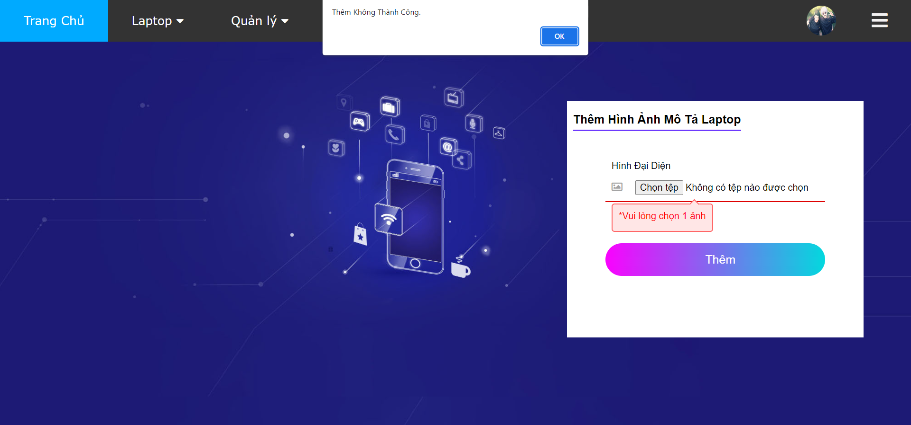
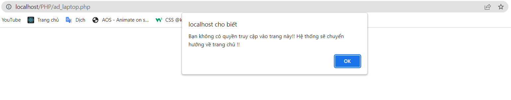

> ## GIỚI THIỆU TRANG WEB PHP LAPTOP
___________________________________________________________________________________________________________________
 **Demo đầy đủ (đã tua nhanh): [tại đây](https://drive.google.com/file/d/19rxZmOdPvkFDjgTpb1HQrlUSjnw3u0On/view?usp=sharing) 
<br>Các video Demo lẻ: [tại đây](https://drive.google.com/drive/folders/1n5aYw11h9ae0ehNC5GEULy9HNfPf4IoL?usp=sharing)
<br>Folder Video Demo: [tại đây](https://drive.google.com/drive/folders/1OI1IZB4d10008jSEun3tmPu-1AokW9oz?usp=sharing)**
___________________________________________________________________________________________________________________
> ### 1. Công nghệ sử dụng
- PHP là chính.
- JavaScript để bắt lỗi Form.
- Ajax để kiểm tra số điện thoại trùng.
- Database MySQL.
> ### 2. Demo trang Web
```PHP
Trang Index
```


```PHP
Thông tin ở cuối trang Web
```


```PHP
Menu khi chưa đăng nhập
```


```PHP
Menu khi khách hàng đăng nhập
```


```PHP
Menu khi Admin đăng nhập
```


```PHP
Trang thông tin cá nhân
```


```PHP
Sửa thông tin cá nhân
```


```PHP
Trang xem Laptop: phân chia theo brand.
```


```PHP
Xem chi tiết Laptop: có thể thêm vào giỏ hàng hoặc thêm vào yêu thích.
```


```PHP
Nếu hết hàng sẽ ẩn nút thêm vào giỏ và yêu thích.
```


```PHP
Trang đăng nhập
```


```PHP
Báo lỗi đăng nhập
```


```PHP
Trang đăng ký
```


***Báo lỗi đăng ký:***
|--------------------------------------------------------------------------------------------------------------------------------------------------------------|
|-	Không được bỏ trống.                                                                                                                                       | 
| -	Mật khẩu phải có cả chữ cái và số, không được có ký tự khác ngoài chữ cái và số, dài từ 6 đến 15 ký tự (dùng biểu thức chính quy).                         | 
| -	Mật khẩu không khớp.                                                                                                                                       |
| -	Email không hợp lệ (dùng biểu thức chính quy).                                                                                                             |
| -	Số điện thoại đã tồn tại. (dùng Ajax).                                                                                                                     | 
| -	Số điện thoại không hợp lệ!! Không đúng định dạng (dùng biểu thức chính quy).                                                                              |


```PHP
Giỏ Hàng có thể thay đổi số lượng sản phẩm, xóa và đặt hàng.
```


```PHP
Trang yêu thích sản phẩm có thể xóa hoặc thêm vào giỏ hàng. Trong trường hợp sản phẩm đã có trong giỏ hàng thì sẽ cộng dồn số lượng lên.
```


```PHP
Trang Đơn Hàng cho phép xem những đơn hàng đã đặt và xem trạng thái đơn hàng. Sắp xếp theo trạng thái đơn hàng.
```


```PHP
Trang quản lý User cho phép thêm, sửa, xóa User. Ngoài ra có thể set “User” thành “Admin” và ngược lại.
```
```PHP
Trang thêm User là trang đăng ký.
```


```PHP
Trang quản lý Laptop cho phép thêm, sửa, xóa Laptop. Ngoài ra còn có sửa trạng thái Laptop. Laptop ở trạng thái “hết hàng” sẽ nằm ở cuối cùng.
Trang này được sắp xếp theo brand.
```


```PHP
Trang quản lý đơn hàng chỉ có tính năng cập nhật trạng thái đơn hàng.
```


```PHP
Cập nhật trạng thái đơn hàng, đơn hàng được sắp xếp theo trạng thái đơn hàng.
```


```PHP
Trang profile của Admin không có tính năng xóa tài khoản.
```


```PHP
Thêm Laptop
```


```PHP
Báo lỗi thêm Laptop không cho bỏ trống.
```


```PHP
Chuyển tiếp sang thêm hình ảnh mô tả Laptop đó.
```


```PHP
Báo lỗi thêm hình ảnh không được bỏ trống.
```



```PHP
Hạn chế không cho người dùng truy cập các trang dành cho Admin. Hiện thông báo và chuyển về trang Index.
```




```PHP
Chưa đăng nhập sẽ không thể vào một số trang như giỏ hàng, yêu thích, đơn hàng, các trang dành cho Admin. Cụ thể là sẽ chuyển hướng về trang đăng nhập.
```


> ### 3.	Một số Logo đã sử dụng trong trang Web
  *Các Logo này do chính chủ làm ra. Logo nhà làm, đơn sơ đạm bạc mong bạn không reup.*
```PHP
Logo trang Web: chữ HT được bao bọc bởi 1 đám mây.. không phải trái tim đâu..
```


```PHP
Logo Sign Up
```


```PHP
Logo Login
```


```PHP
Logo Profile
```


